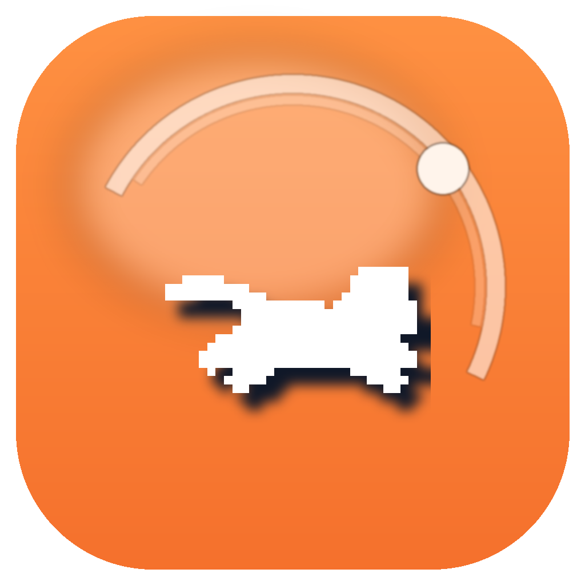

<div align="center">
  
  <h1>FocusOrange</h1>
  <p>一款围绕番茄钟、奔跑小猫反馈和本地数据连续性设计的桌面专注应用。</p>
  <p>
    <a href="https://github.com/August1314/FocusOrange">GitHub</a> ·
    <a href="./release-app/mac-arm64/FocusOrange.app">macOS App</a> ·
    <a href="./release-dmg/FocusOrange-0.0.0-arm64.dmg">DMG</a>
  </p>
</div>

FocusOrange 是一个以番茄钟为核心的桌面专注应用。它把倒计时、跑动进度、历史记录和统计分析放在一个轻量界面里，目标不是做复杂任务管理，而是让单次专注更直接、更有反馈。

## 应用介绍

这个应用围绕“开始专注 -> 完成一轮 -> 留下记录 -> 回看趋势”这条最短路径设计。

- 倒计时界面提供专注、短休息和长休息切换
- 进度条使用奔跑小猫作为反馈，完成度更直观
- 结束提示音已调整为更短、更平缓的猫叫
- 历史记录支持查看、备注和删除
- 统计页提供按日、周、月、年的聚合视图，以及年度热力网格

## 当前特性

- 自定义专注时长、短休息时长、长休息时长
- 本地保存计时配置
- 本地保存专注记录
- 记录完成时长、标签、备注和状态
- 桌面版数据持久化到本机用户目录，重建 `.app` 后不会因为构建目录变化而直接丢失数据
- 支持打包为 macOS `.app` 与 `.dmg`

## 适合谁

- 想要一个界面轻、反馈明确的番茄钟应用
- 希望数据保存在本机，不依赖账号和云同步
- 希望同时拥有桌面端使用体验和可自行打包的项目源码

## 项目入口

- 仓库地址：<https://github.com/August1314/FocusOrange>
- 桌面应用产物：`release-app/mac-arm64/FocusOrange.app`
- 分发安装包：`release-dmg/FocusOrange-0.0.0-arm64.dmg`

## 技术说明

- 前端：React + Vite + TypeScript
- 动效与图表：Motion + Recharts
- 桌面封装：Electron
- 本地数据：Electron `userData` 目录下的 JSON 文件

桌面版当前使用的用户数据目录为：

- `/Users/lianglihang/Library/Application Support/FocusOrange`

主要数据文件：

- `focus-records.json`
- `settings.json`

## 本地运行

前置要求：

- Node.js

启动开发环境：

```bash
npm install
npm run dev
```

## 桌面运行

直接以 Electron 方式启动：

```bash
npm run desktop
```

## 打包

构建前端资源：

```bash
npm run build
```

打包 macOS `.app`：

```bash
npm run build:app
```

打包 macOS `.dmg`：

```bash
npm run build:dmg
```

默认输出目录：

- `.app`：`release-app/mac-arm64/FocusOrange.app`
- `.dmg`：`release-dmg/FocusOrange-0.0.0-arm64.dmg`

## 当前边界

- 目前以单用户本地使用为主，不包含云同步
- 当前为 ad-hoc 签名，适合本机和测试分发
- 历史记录服务层已经具备完整 CRUD，但界面层当前主要暴露查看、备注和删除
